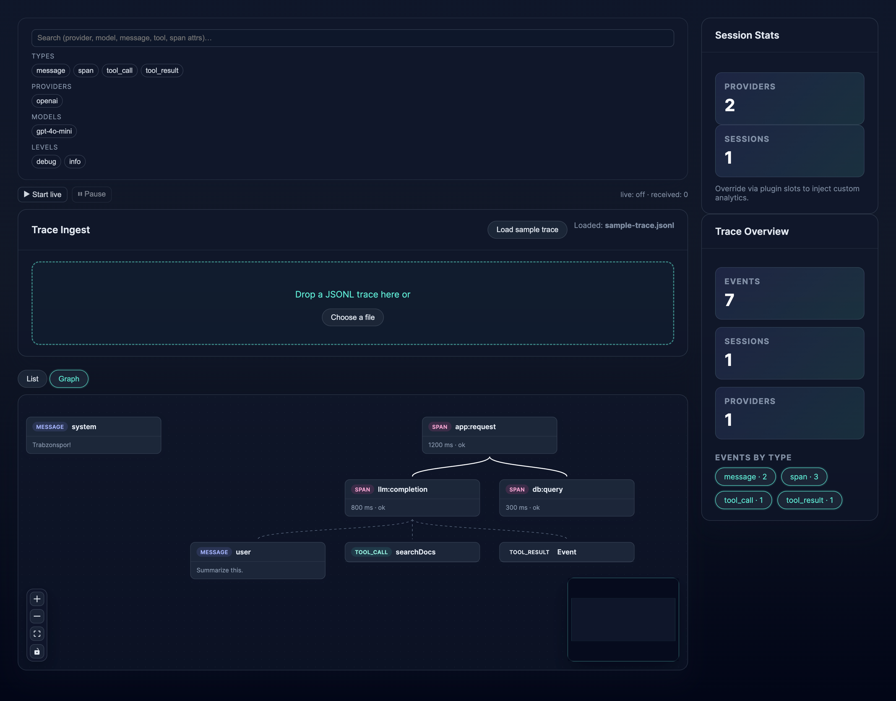
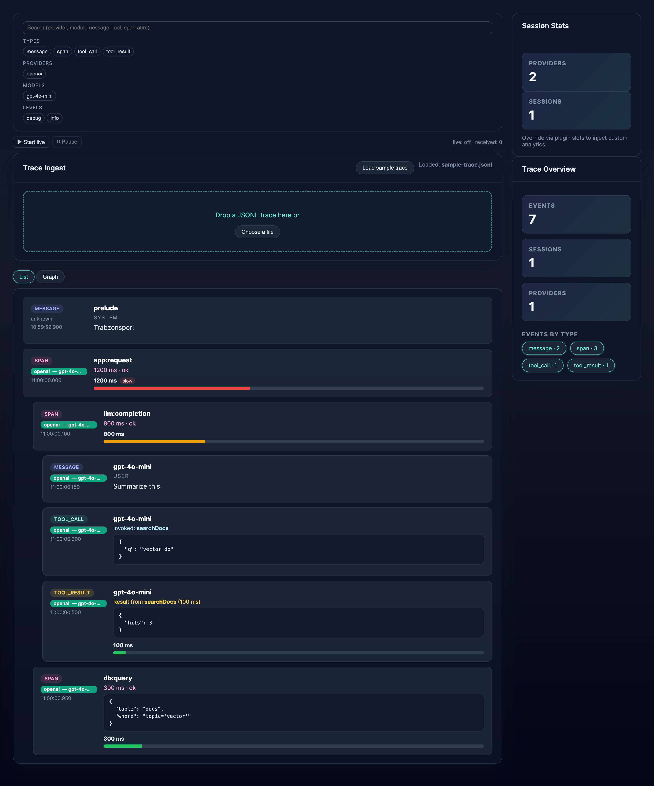

# @accordkit/viewer

The AccordKit Viewer is a lightweight, pluggable trace viewer for AI tool and model observability.
It visualizes traces, spans, messages, and tool calls in real time, with plugin slots for custom visualizations and metrics.

---

## Orchestrator Graph View

Automatically render your entire trace as an interactive Directed Acyclic Graph (DAG) to understand the real flow of your agent.

<div align="center" style="margin: 1.5rem 0; display: flex; gap: 1rem; flex-wrap: wrap; justify-content: center;">
  
</div>

## Hierarchical List View

A classic, indented list that's 10x clearer than a flat log, complete with latency bars, plugin support, and deep inspection.

<div align="center" style="margin: 1.5rem 0; display: flex; gap: 1rem; flex-wrap: wrap; justify-content: center;">
  
</div>

## Getting Started

### 1. Install dependencies

```bash
pnpm install
```

### 2. Run the dev server

```bash
pnpm dev
```

Then open http://localhost:5173

### 3. Run the full app (with mock server)

To see live streaming in action, run this command to start the Vite server and the mock SSE server.

```bash
pnpm dev:all
```

### 4. Load sample traces

Inside the app, click “Load sample trace” — or provide your own .json trace exported from the AccordKit tracer SDK.

### 5. Extend with your own plugin

```tsx
import { PluginProvider } from "./plugins";
import { LatencyBarPlugin } from "./plugins/LatencyBarPlugin";
import App from "./App";

export function Main() {
  return (
    <PluginProvider slots={{ EventExtras: LatencyBarPlugin }}>
      <App />
    </PluginProvider>
  );
}
```

---

## ✨ Features

- ⚡ Blazing Fast & 100% Local: Drag-and-drop a trace file and start exploring. No login, no backend.
- 🧠 Orchestrator Graph View: Automatically renders your trace as an interactive xyflow DAG to understand agent flow.
- 🔬 Hierarchical List View: A classic, indented list that correctly visualizes parent-child relationships, tool calls, and latencies.
- 🪶 Trace and event visualization — Inspect spans, messages, tool calls, and results
- 🔴 Live Streaming (SSE/WS): Connect to a live event stream (like the included mock server) and watch traces build in real-time.
- 🧩 Extensible Plugin System: Add custom components to the UI using React slots (TopBanner, RightPanel, EventExtras).
- ⚡ Latency and usage plugins — Example: LatencyBarPlugin shows timing and token usage
- 🔍 Advanced filters — Filter by type, provider, model, log level, or full-text search
- 🧠 Typed utils — Fully typed build functions (buildSpanForest, eventFilters), zero any

---

## 🧩 Plugin API

The viewer is fully extensible through slots:

```tsx
import { PluginProvider } from "./plugins";
import { LatencyBarPlugin } from "./plugins/LatencyBarPlugin";

<PluginProvider slots={{ EventExtras: LatencyBarPlugin }}>
  <App />
</PluginProvider>;
```

Available slots:
| Slot name | Props | Description |
| ------------- | --------------------------- | ---------------------------------------------- |
| `TopBanner` | none | Renders a banner at the top of the viewer |
| `RightPanel` | `{ events: TracerEvent[] }` | Custom side panel content |
| `EventExtras` | `{ event: TracerEvent }` | Extra per-event content (e.g. latency, tokens) |

Each slot receives contextual props (e.g. { event } for EventExtras).

Example plugin:

```ts
import type { TracerEvent } from "@accordkit/tracer";

export function LatencyBarPlugin({ event }: { event: TracerEvent }) {
  if (event.type !== "span") return null;
  return (
    <div style={{ fontSize: "0.75rem", opacity: 0.8 }}>
      ⏱ {event.durationMs} ms
    </div>
  );
}
```

---

## Scripts

| Command        | Description                          |
| -------------- | ------------------------------------ |
| `pnpm dev`     | Start the Vite dev server with HMR.  |
| `pnpm dev:all` | Start React and Node dev servers.    |
| `pnpm build`   | Type-check and build for production. |
| `pnpm test`    | Run Vitest unit/integration tests.   |
| `pnpm lint`    | Run ESLint (TypeScript + React).     |
| `pnpm format`  | Format sources with Prettier.        |

---

## JSONL Event Format

Each line should be a single AccordKit `TracerEvent` (the same shape emitted by
the tracer or provider adapters). Example:

```jsonl
{"ts":"2024-05-04T10:00:00.000Z","sessionId":"sess_1","level":"info","ctx":{"traceId":"tr_1","spanId":"sp_1"},"type":"message","role":"user","content":"Ping"}
{"ts":"2024-05-04T10:00:01.000Z","sessionId":"sess_1","level":"info","ctx":{"traceId":"tr_1","spanId":"sp_2","parentSpanId":"sp_1"},"type":"tool_call","tool":"weather","input":{"city":"AMS"}}
{"ts":"2024-05-04T10:00:02.000Z","sessionId":"sess_1","level":"info","ctx":{"traceId":"tr_1","spanId":"sp_2"},"type":"tool_result","tool":"weather","output":{"temp":12},"ok":true,"latencyMs":1200}
```

Invalid lines are skipped and surfaced in the UI with line numbers so you can
inspect problematic entries.

---

## 🧩 Development Philosophy

AccordKit Viewer follows a few guiding principles:

- Typed-first: Every line of code is strictly typed and checked end-to-end.
- Composable core: Everything is a slot, a hook, or a pure function.
- Observable by design: Focused on clarity, not complexity. Every trace tells a story.
- Open & extensible: No lock-in. Just React, TypeScript, and your imagination.
- Performance-aware: Works well with tens of thousands of events and spans.

The goal: make AI tool tracing human-readable.

---

## 🪪 License

MIT © AccordKit Contributors

## 🤝 Contributing

Issues and PRs welcome!
